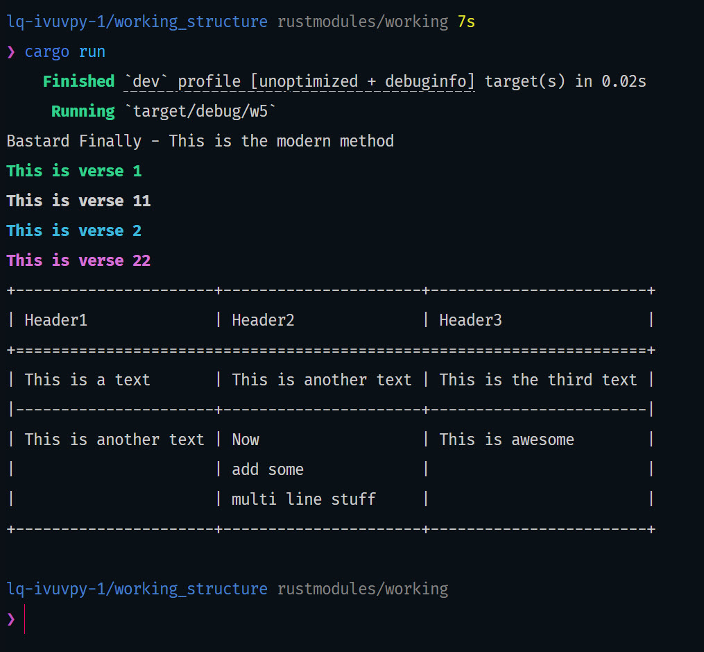

---
1. [Working Structure](#working-structure)
2. [File Tree](#file-tree)
3. [ScreenShot](#screenshot)


---

# Working Structure 

After spending lots of time this is directory has the modern working strucutre 

# File Tree 

1. Note all the main files are inside `src/`

```ml
src
├── main.rs
├── sing
│  ├── table1.rs
│  ├── verse1.rs
│  └── verse2.rs
└── sing.rs
```

# ScreenShot 

